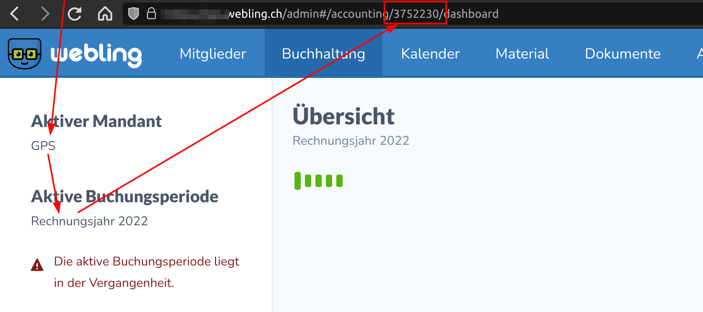

# Webling Delete Open Debtors

Deletes all open debtors of a given period from Webling. 

## Why is this needed

Deleting many debtors is a tedious task to do manually, as you can only
delete a relatively small amount of debtors at a time, and it takes ages.

## What it does

It searches for all debtors with the state `open` of a given period and deletes 
them.

## Installation

```
# Clone this repository
git clone git@github.com:grueneschweiz/webling-debtors-delete.git

# Create a [virtual environment](https://docs.python.org/3/library/venv.html)
python3 -m venv venv

# Load the virtual environment (for Bash on GNU/Linux and MacOS)
# Other environments: https://packaging.python.org/en/latest/guides/installing-using-pip-and-virtual-environments/#activating-a-virtual-environment
source venv/bin/activate

# Install requirements 
pip3 install -r requirements.txt

# Set API_URL and API_KEY
echo "API_KEY=***" > .env
echo "API_URL=https://***.webling.ch/api/1" >> .env
chmod 600 .env
```

The API_KEY must have the following permissions:

- Read and write access for the accounting concerned
- Read and write access the all members (why?)


## Usage

```
# Load the virtual environment (for Bash on GNU/Linux and MacOS)
# Other environments: https://packaging.python.org/en/latest/guides/installing-using-pip-and-virtual-environments/#activating-a-virtual-environment
source venv/bin/activate

# help
python3 -u main.py -h

# dry run
python3 -u main.py <period_id> --dry-run [--batch-size=<batch_size>]

# run
python3 -u main.py <period_id> [--batch-size=<batch_size>]
```

The period ID can be found in the URL of the accounting period in Webling.
